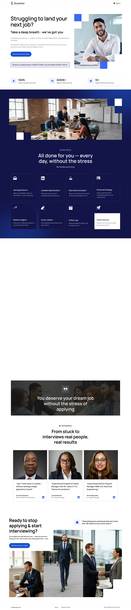

# Scowter Landing Page

A modern SaaS landing page developed by **Softrare Labs** for **Scowter**, a recruitment support platform designed to simplify the job search experience for candidates.

The landing page presents Scowter’s service offering through a fast, responsive, and conversion-focused marketing website built to communicate trust, clarity, and action.

---

## Project Overview

Scowter helps candidates reduce the stress of job searching by supporting applications, communication, and job-hunting workflows.

Softrare Labs developed the public-facing landing page UI for the platform, translating brand messaging and marketing content into a polished web experience. The work focused on frontend implementation, responsive layouts, interactive sections, lead capture flows, and performance-conscious delivery.

> **Note:** This repository is used as a public project showcase. The full source code is not included due to client confidentiality and intellectual property considerations.

---

## Goals & Challenge

The goal was to build a high-quality SaaS marketing page that clearly explains Scowter’s value and encourages potential users to take action.

Key objectives included:

- Create a polished public-facing landing page.
- Communicate Scowter’s job-search support model clearly.
- Build responsive layouts for desktop, tablet, and mobile users.
- Turn marketing content into an engaging user experience.
- Add smooth animations, sliders, and interactive sections.
- Integrate lead capture forms and user feedback states.
- Optimize performance for fast loading and smooth browsing.
- Keep the implementation focused on the marketing website scope.

---

## Softrare Labs Solution

Softrare Labs developed the Scowter landing page with a strong focus on conversion, usability, and frontend quality.

The interface uses responsive sections, structured messaging, smooth transitions, carousel components, and clear lead capture flows. The frontend was built with Next.js, React, TypeScript, Tailwind CSS, and modern interaction libraries to deliver a fast and professional SaaS marketing experience.

---

## Key Features

- Conversion-focused SaaS landing page
- Fully responsive marketing website
- Mobile-first frontend implementation
- Clear service messaging and content structure
- Smooth animations and transitions
- Carousel and slider components
- Lead capture form integration
- EmailJS communication workflow
- Brevo API lead forwarding support
- International phone number input
- Loading states and feedback indicators
- Type-safe frontend development
- Performance-conscious Next.js implementation

---

## Tech Stack

- **Next.js 15** - App routing and high-performance frontend rendering
- **React 19** - Component-based UI development
- **TypeScript** - Type-safe frontend development
- **Tailwind CSS 4** - Utility-first responsive styling
- **Framer Motion** - UI animations and transitions
- **Swiper** - Sliders and carousel components
- **MUI Icons** - Material iconography
- **Emotion** - Styled component utility support
- **EmailJS** - Frontend email form integration
- **Brevo API** - Lead capture and CRM data forwarding
- **React Phone Number Input** - International phone input field
- **React Spinners** - Loading indicators and feedback states

---

## Screenshots

### Landing Page

A modern SaaS landing page designed to explain Scowter’s recruitment support service and guide visitors toward lead submission.

---

## Live Preview

Visit the live website:

[https://scowter.com/hire-us](https://scowter.com/hire-us)

---

## Outcome & Impact

The Scowter landing page provides a clear, responsive, and conversion-focused public website for presenting the platform’s job-search support service.

The project delivers a strong frontend foundation for lead generation, service explanation, and marketing visibility while keeping the experience fast, polished, and easy to navigate.

---

## Privacy Notice

This is a private client project. The repository is intended only to showcase the project overview, design direction, technology stack, screenshots, and live website reference.

The full source code, private configuration, API credentials, business logic, and implementation details are not publicly shared.

---

## About Softrare Labs

**Softrare Labs** is a web design and development agency helping businesses, organizations, and founders build modern, responsive, and high-performing websites.

We focus on clean design, reliable development, user experience, and launch-ready digital products for clients in the USA, Italy, Europe, and worldwide.

**Design. Develop. Launch.**

---

© 2026 Softrare Labs. Project showcased for portfolio and case study purposes.
